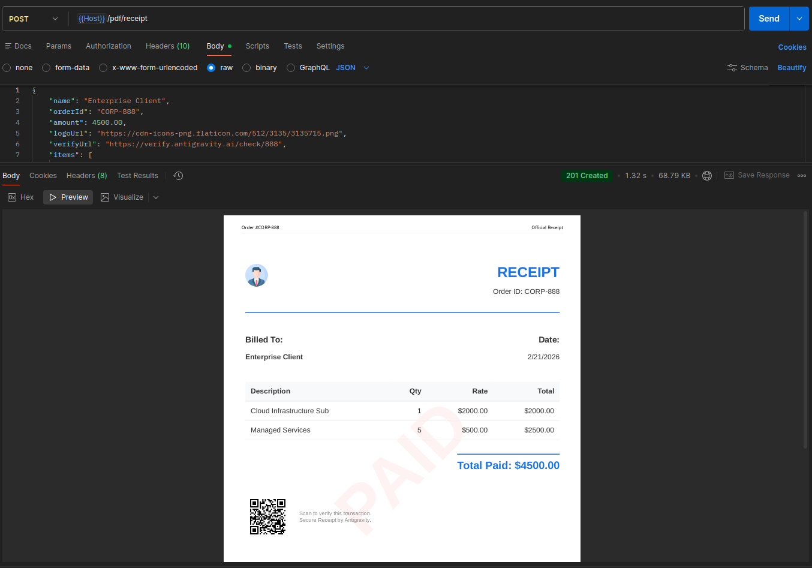

# Node PDF Generator 🚀

An enterprise-grade, high-performance NestJS service to generate branded, multi-page PDFs using Puppeteer.

## Previews 📸


*Professional Branded PDF with QR Code and Watermark*


*Included Postman Collection for easy testing*

## Key Features

- **Singleton Browser Pooling**: Efficiently reuses Chromium instances using incognito contexts to minimize memory overhead.
- **Concurrency Control**: Integrated request queuing via `p-queue` to handle traffic spikes without crashing.
- **Advanced HTML Templates**: Ready-to-use branded receipt layout with:
  - **Dynamic QR Codes**: Auto-generated from verification URLs.
  - **Watermarks**: Semi-transparent "PAID" watermark on every page.
  - **Multi-page Support**: Automatic headers and footers with page numbering.
- **Strict Validation**: Type-safe endpoints using `class-validator` and `class-transformer`.
- **Production Ready**: Optimized for Linux/EC2 environments with necessary Puppeteer flags.

---

## Getting Started

### Prerequisites

- Node.js (v18+)
- Chromium (for Linux servers)

### Installation

```bash
# Install dependencies
npm install
```

### Running the App

```bash
# development
npm run start:dev

# production mode
npm run build
npm run start:prod
```

---

## API Documentation

### 1. Generate Receipt (GET)
Use for simple download links.
`GET /pdf/receipt?name=John+Doe&orderId=INV-001&amount=599.99&logoUrl=...&verifyUrl=...`

### 2. Generate Receipt (POST) - **Recommended**
Use for complex data or item lists.
`POST /pdf/receipt`

**Payload Example:**
```json
{
    "name": "Jane Smith",
    "orderId": "INV-2026-X",
    "amount": 1250.00,
    "logoUrl": "https://example.com/logo.png",
    "verifyUrl": "https://verify.me/inv-x",
    "items": [
        { "description": "Consulting Fee", "quantity": 1, "rate": 1000 },
        { "description": "Taxes", "quantity": 1, "rate": 250 }
    ]
}
```

---

## Testing

1. **Postman**: Import `postman_collection.json` located in the root directory.
2. **Automated Verification**: Run `npx ts-node verify-unified.ts` to simulate a production render.
3. **Guide**: Refer to [TESTING_GUIDE.md](./TESTING_GUIDE.md) for detailed steps.

---

## Deployment

For Ubuntu/EC2 setup, see [PRODUCTION_GUIDE.md](./PRODUCTION_GUIDE.md).

## License
MIT
